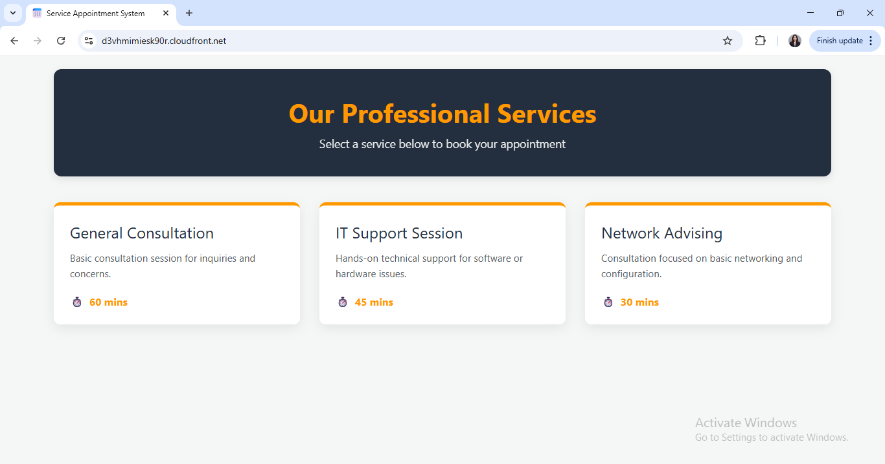
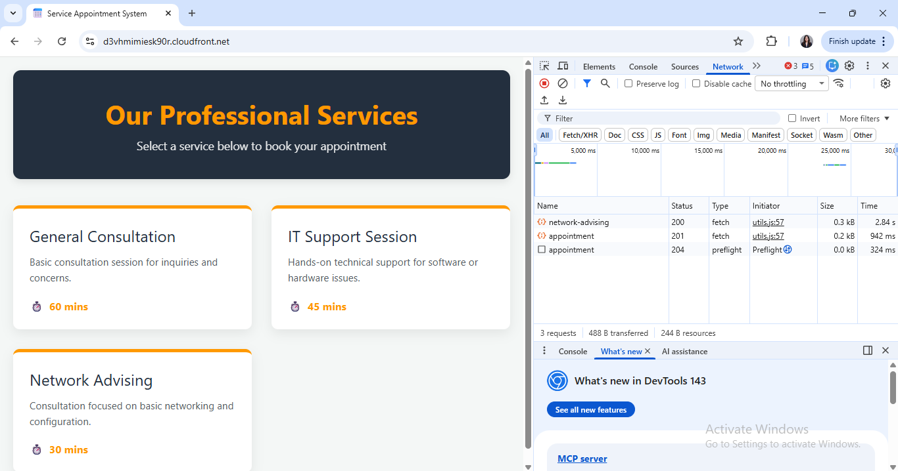
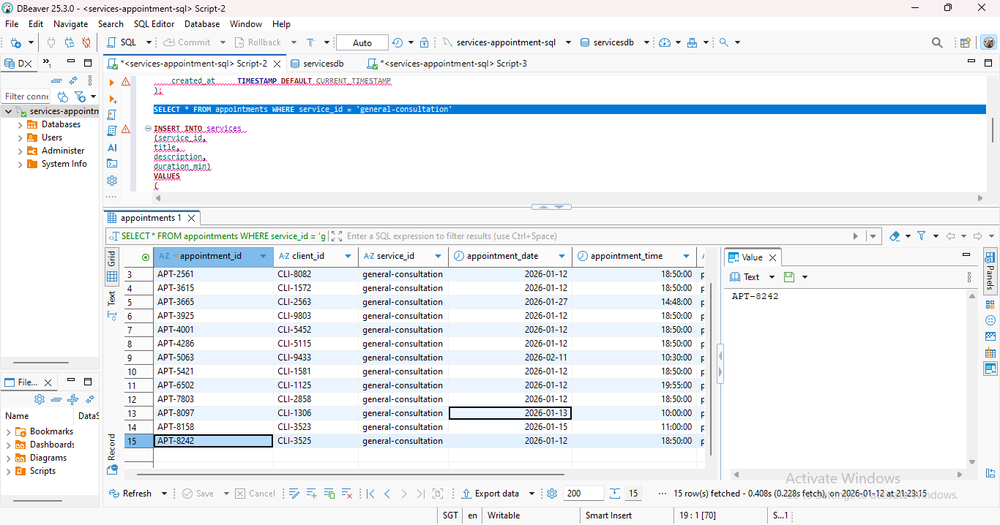

# 🚀 Serverless Service Appointment System
A full-stack, cloud-native appointment booking application built with AWS. This system allows users to view professional service offerings and book appointments in real-time through a scalable serverless architecture.

## 🛠️ Tech Stack & Architecture
This project leverages a **Serverless Architecture** to ensure high availability, global distribution, and cost-efficiency:

* **Frontend:** Developed using HTML5, CSS3, and Vanilla JavaScript (ES6+).
* **Hosting & Distribution:** Hosted on **Amazon S3** and distributed globally via **Amazon CloudFront** (HTTPS) for low-latency access.
* **API Management:** Utilizes **Amazon API Gateway** to manage RESTful endpoints and secure communication between the frontend and backend.
* **Compute:** **AWS Lambda** (Node.js) serves as the backend engine, handling business logic and database transactions.
* **Databases (Polyglot Persistence):**

   * **Amazon RDS (MySQL):** Stores relational data for the Service Catalog (Service IDs, Titles, Descriptions, and Durations).
   
    * **Amazon DynamoDB:** A NoSQL database used for high-speed storage of client transactional records and appointment logs.
* **Monitoring & Logging:** Integrated with **Amazon CloudWatch** for real-time error tracking and execution logs.

## 📸 Proof of Work

### 1. User Interface (Dynamic Frontend)
The frontend successfully retrieves and displays service cards (General Consultation, IT Support, and Network Advising) directly from the MySQL database.

### 2. API Integration & Booking Success
The browser's Network tab confirms a **Status 201 (Created)**, verifying that the frontend successfully posted data to the cloud backend.

### 3. Database Verification (SQL & NoSQL)
* **MySQL (RDS):** Database schema and service records as viewed in DBeaver, confirming the persistence of the relational data.
* **DynamoDB:** The 'Items' view shows the client records successfully saved in the NoSQL table after a booking.

## 💡 Key Learnings & Achievements
* **CDN Implementation:** Configured CloudFront distributions to provide secure (SSL) and fast global content delivery.
* **Serverless Backend:** Implemented AWS Lambda functions with proper layers and environment variables for database connectivity.
* **Database Management:** Successfully managed a hybrid database environment using both Relational (SQL) and Non-Relational (NoSQL) solutions.

